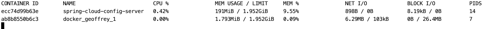

# Geoffrey
Is a lightweight config server written in Go based on Git private repositories based on Spring Cloud Config Server. 

It is easy to use and getting started. 

## Getting Started
You can clone this repo, build the latest version or run the following command:

```bash
$ go install github.com/solivaf/go-geoffrey #requires go 1.12+

$ GEOFFREY_CONFIG=./config/application.yml go-geoffrey
```

Geoffrey depends on a yaml configuration file with repository configuration which will be used to download
your configuration files. 
```bash
$ GEOFFREY_CONFIG=./config/new-application.yml go-geoffrey
```

```yaml
#new-application.yml
server:
  port: 9090

git:
  url: https://github.com/solivaf/go-maria #default repository is always required
  credential:
    username: solivaf
    password: somedumbpassword
  repositories:
    - name: config-properties #some specific repository
      url: https://github.com/solivaf/config-properties-foo
      credential:
        username: solivaf
        password: somedumbpassword
```

### Running with Docker

You can run Geoffrey with docker and must provide a base configuration file through the environment variable **GEOFFREY_CONFIG**
as you can see in the example below:

```yaml
version: '3'

services:
  go-geoffrey:
    image: fernandosolivas/go-geoffrey:latest
    volumes:
      - ./config/:/app/config
    environment:
      - GEOFFREY_CONFIG=/app/config/
    entrypoint: /go/bin/go-geoffrey
```
and you will have your config server running.

## Usage
You can run Geoffrey on a docker container with the following command:

```bash
$ docker run -it --name geoffrey -v <absolute-config-path>:/app/config -e GEOFFREY_CONFIG=/app/config/ fernandosolivas/go-geoffrey:latest /go/bin/go-geoffrey
```

Now you will have a server running and you can get your configurations through a http request as:

```bash
$ curl http://localhost:<server-port>/<app-name>/<env>
```

Where <server-port> is the property in application.yml located in GEOFFREY_CONFIG path, <app-name> is your application name
and <env> is the file environment. See the example below.

```bash
$ curl http://localhost:8080/message/dev
#response
bar:
  foo: testPropertiesYml
```

In this case, geoffrey will search a file named message-dev.yml inside the repositories specified inside the application.yml
in GEOFFREY_CONFIG path.

## Comparison

Comparing Geoffrey with Spring Cloud Config Server we see a big difference in resource allocation. Just running docker
containers without any particular configuration we see something like the image below



## Contributing

Please read [CONTRIBUTING.md](https://gist.github.com/solivaf/20f1873a92f0a0c7376f0a92537658a6) for details on our code of conduct, and the process for submitting pull requests to us.

## Authors

* **[Fernando Soliva](https://github.com/solivaf)** - *Initial work*

See also the list of [contributors](https://github.com/solivaf/go-geoffrey/contributors) who participated in this project.